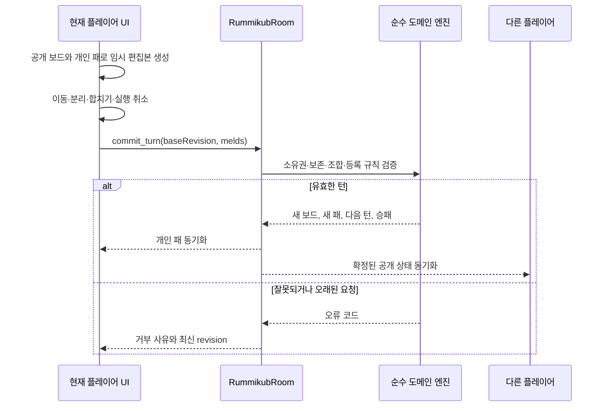

# 루미큐브 구현 계획

## 구현 현황

2026-07-16 기준 코드 구현 상태다. TypeScript 구문 및 타입 진단, Vue SFC script/template 구문
검사와 신규 클라이언트 상대 import 검사는 통과했다. 저장소 정책에 따라 자동 테스트, 빌드와
브라우저 수동 검증은 아직 실행하지 않았다.

- [x] 106개 타일 생성, 그룹·런·조커·30점 최초 등록 규칙
- [x] revision과 타일 보존 검사를 포함한 원자적 턴 제출 엔진
- [x] 공개 보드와 플레이어별 비공개 패 분리
- [x] 좌석 예약, 재접속, 게임 종료 및 테이블 복귀
- [x] 로컬 보드 편집, 조합 생성·해체·합치기, 순서 변경, 실행 취소
- [x] 서버 게임 레지스트리와 클라이언트 동적 로더 연결
- [x] 규칙·엔진·점수·프로토콜·공개 상태 테스트 코드 작성
- [ ] 사용자 자동 테스트 및 서버·클라이언트 빌드
- [ ] 두 브라우저와 모바일 폭 수동 플레이 검증

## 1. 결정 사항

루미큐브는 기존 게임과 동일한 `로비 → 테이블 → 게임 룸 → 테이블 복귀` 흐름으로 추가한다.
게임 ID는 `rummikub`, 프로토콜 버전은 `1`, 지원 인원은 2~4명으로 정한다.

초기 버전은 다음 규칙을 지원한다.

- 숫자 1~13, 네 가지 색상, 각 조합 2장과 조커 2장으로 총 106개 타일
- 플레이어별 시작 타일 14개
- 게임 시작 시 서버가 참가자 중 선 플레이어를 무작위로 결정
- 같은 숫자·서로 다른 색상 3~4개로 이루어진 그룹
- 같은 색상·연속 숫자 3개 이상으로 이루어진 런
- 숫자 1은 가장 낮은 숫자로만 사용하고 13 뒤에 이어 붙이지 않음
- 첫 등록은 자신의 패만 사용하고 합계 30점 이상
- 등록 후 기존 보드의 타일을 포함한 전체 재배치 허용
- 타일을 내지 않는 턴에는 풀에서 1개를 가져오고 즉시 턴 종료
- 패를 먼저 비운 플레이어가 승리하며, 남은 패 점수와 조커 30점 벌점으로 결과 계산
- 풀이 비고 모든 플레이어가 연속으로 패스하면 남은 패 점수가 가장 낮은 플레이어가 승리

규칙 기준은 [Rummikub 공식 영문 규칙](https://rummikub.com/wp-content/uploads/2019/12/2600-English.pdf)으로 삼는다.
공식 규칙의 1분 턴 제한과 시간 초과 시 3장 벌칙은 초기 버전에서 제외하고 후속 옵션으로 둔다.
기존 게임과 마찬가지로 한 판이 끝나면 공통 재대결 흐름을 통해 새 테이블로 돌아간다.

## 2. 핵심 설계

### 2-1. 서버 권한과 상태 경계

서버가 덱, 모든 플레이어의 실제 패, 턴, 보드 유효성, 점수와 승패를 최종 판정한다.
닉네임은 표시용으로만 사용하며 플레이어 권한과 타일 소유권은 `sessionId`로 판정한다.

| 상태 | 포함 내용 | 전달 범위 |
|---|---|---|
| 공개 Schema | 플레이어, 패 개수, 등록 여부, 현재 턴, 보드 조합, 풀 개수, revision, 결과 | 방 전체 |
| 개인 메시지 | 자신의 타일 전체 | 해당 플레이어 |
| 서버 내부 | 풀의 순서, 모든 플레이어의 실제 패, 연속 패스 수 | 서버만 |
| 클라이언트 임시 상태 | 현재 턴의 보드·개인 패 편집본, 선택 타일, 실행 취소 기록 | 해당 브라우저만 |

다른 플레이어의 타일과 풀 순서는 공개 Schema, 로그, 오류 응답에 포함하지 않는다. 재접속한
플레이어에게는 공개 상태와 자신의 패만 다시 전송한다.

### 2-2. 턴 단위 원자적 제출

루미큐브는 기존 보드의 여러 조합을 한 턴에 재배치할 수 있으므로 타일 이동 하나마다 서버
상태를 변경하지 않는다. 현재 플레이어는 클라이언트에서 임시 보드를 편집하고, `턴 확정` 시
최종 조합과 기준 revision을 한 번 제출한다.



서버는 제출을 다음 순서로 검증한다.

1. 요청자가 현재 턴의 생존 플레이어인지 확인한다.
2. `baseRevision`이 현재 보드 revision과 같은지 확인한다.
3. 조합 수, 조합별 타일 수, 전체 타일 ID 수의 상한을 확인한다.
4. 중복 ID, 존재하지 않는 ID, 다른 플레이어 또는 풀의 타일을 거부한다.
5. 기존 보드의 모든 타일이 제출 결과에 정확히 한 번 남아 있는지 확인한다.
6. 새로 추가된 타일이 요청자의 패에서만 왔고 최소 한 개 이상인지 확인한다.
7. 모든 그룹과 런이 유효하며 보드에 낱개 타일이 없는지 확인한다.
8. 미등록 플레이어라면 기존 보드를 바꾸지 않았고 자기 패로 만든 새 조합의 합이 30점 이상인지 확인한다.
9. 조커가 회수되었다면 같은 턴의 유효 조합에 다시 사용되었는지 확인한다.
10. 검증 전체가 성공한 경우에만 보드, 패, revision과 턴을 함께 변경한다.

어느 단계에서든 실패하면 서버 상태를 전혀 변경하지 않는다. 클라이언트는 규칙 오류일 때
임시 편집본을 유지해 수정할 수 있게 하고, revision 충돌일 때만 최신 서버 상태로 초기화한다.

### 2-3. 조합 표현

각 실물 타일은 같은 색상과 숫자라도 구분되는 고유 `tileId`를 가진다. 클라이언트는 조합을
타일 ID의 순서 있는 배열로 제출한다.

```ts
interface CommitTurnPayload {
  baseRevision: number;
  melds: Array<{
    tileIds: string[];
  }>;
}
```

런은 배열 순서로 조커가 나타내는 숫자를 판정한다. 그룹에서는 실제 숫자 타일이 그룹의 숫자를
결정하고 조커는 비어 있는 색상을 대신한다. 도메인 검증기는 조합 종류, 조커의 해석, 점수를 함께
반환하여 첫 등록 점수와 화면 안내에서 같은 계산을 재사용한다.

## 3. 서버 구현 범위

다음 모듈을 새로 만든다.

```text
server/src/games/rummikub/
  metadata.ts
  definition.ts
  protocol.ts
  protocol.spec.ts
  schema.ts
  schema.spec.ts
  room.ts
  domain/
    types.ts
    deck.ts
    deck.spec.ts
    rules.ts
    rules.spec.ts
    engine.ts
    engine.spec.ts
    scoring.ts
    scoring.spec.ts
```

### 파일별 역할

- `metadata.ts`: `rummikub`, 표시명, 2~4명, 프로토콜 버전, 재대결 방 제목 정의
- `definition.ts`: 메타데이터와 `RummikubRoom` 결합
- `protocol.ts`: `commit_turn`, `draw_tile`, `start_game`, `request_private_state`,
  `pass_turn`, `private_rack`, `return_to_table` 메시지와 런타임 검증 정의
- `schema.ts`: 공개 타일, 공개 조합, 플레이어 요약, 턴과 결과 상태 정의
- `domain/deck.ts`: 106개 고유 타일 생성, 난수 주입이 가능한 셔플과 14개씩 배분
- `domain/rules.ts`: 그룹, 런, 조커 해석, 첫 등록 점수 검증
- `domain/engine.ts`: 턴 제출의 타일 보존·소유권·등록·revision 검증과 상태 전이
- `domain/scoring.ts`: 정상 종료와 풀 소진 종료의 점수 및 순위 계산
- `room.ts`: 좌석 예약, 재접속, 방장, 메시지 라우팅, 개인 패 동기화, 재대결 처리

### 공개 Schema 초안

```text
RummikubState
  players: Map<RummikubPlayer>
  melds: Array<RummikubMeld>
  currentTurnId: string
  hostSessionId: string
  gamePhase: waiting | playing | finished
  poolCount: number
  boardRevision: number
  consecutivePasses: number
  winnerSessionId: string
  rankings: string[]
  lastAction: string
  migrationReady: boolean

RummikubPlayer
  sessionId: string
  nickname: string
  isHost: boolean
  handCount: number
  hasInitialMeld: boolean
  score: number
  rank: number
```

서버 내부에는 `Map<sessionId, Tile[]>` 형태의 패와 `Tile[]` 형태의 풀을 둔다. 공개 보드의
타일은 모두에게 보여도 되지만 다른 플레이어의 패 타일 ID는 개인 메시지 외에는 보내지 않는다.

### 오류 코드

- `NOT_YOUR_TURN`
- `STALE_BOARD_REVISION`
- `INVALID_MELD`
- `INITIAL_MELD_REQUIRED`
- `INITIAL_MELD_TOO_LOW`
- `TILE_NOT_OWNED`
- `DUPLICATE_TILE`
- `BOARD_TILE_MISSING`
- `MOVE_TOO_LARGE`
- `GAME_NOT_PLAYING`

`pass_turn`은 풀이 비었을 때만 허용한다. 풀이 남아 있으면 플레이를 포기한 사용자는
`draw_tile`로 한 장을 받고 턴을 종료한다.

오류 로그에는 게임 ID, 룸 ID, 오류 코드만 남기고 패, 풀, 전체 제출 payload는 기록하지 않는다.

## 4. 클라이언트 구현 범위

다음 모듈과 컴포넌트를 추가한다.

```text
client/src/games/rummikub/
  View.vue
  protocol.js
  state.js
  draft.js

client/src/components/games/
  RummikubView.vue
  rummikub/
    RummikubBoard.vue
    RummikubMeld.vue
    RummikubTile.vue
    RummikubRack.vue
    RummikubPlayerPanel.vue
    RummikubTurnControls.vue
    RummikubResultModal.vue
```

### 상태 처리

- `state.js`는 공개 Schema에서 화면에 필요한 값만 투영한다.
- 개인 패는 `private_rack` 메시지로 별도 관리하고 재접속 시 다시 요청한다.
- `draft.js`는 서버 상태와 분리된 현재 턴의 편집본, 실행 취소, 초기화와 제출 payload 생성을 담당한다.
- 서버 state가 변해도 현재 revision과 같은 동안에는 사용자의 임시 편집을 덮어쓰지 않는다.
- revision이 달라지거나 턴이 끝나면 임시 편집을 폐기하고 확정 상태를 다시 투영한다.

### 화면 구성

- 보드: 확정 조합과 현재 플레이어의 임시 조합을 명확히 구분
- 개인 패: 숫자·색상 정렬, 선택, 보드로 이동, 남은 개수 표시
- 턴 컨트롤: 실행 취소, 턴 처음으로, 턴 확정, 타일 가져오기 또는 풀 소진 시 패스
- 등록 안내: 첫 등록 전에는 현재 제출 점수와 30점 충족 여부 표시
- 플레이어 패널: 닉네임, 방장, 현재 턴, 패 개수, 등록 여부 표시
- 결과 모달: 순위, 남은 패 점수, 재대결 테이블 복귀

드래그만으로 조작을 강제하지 않는다. Pointer Events 기반 이동과 함께 타일 선택 후 조합으로
보내기, 새 조합 만들기, 패로 되돌리기 버튼을 제공해 모바일과 키보드에서도 같은 행동을 할 수
있게 한다. 보드가 길어질 때는 조합 단위 줄바꿈과 가로 스크롤을 함께 사용한다.

## 5. 기존 구조 연결 지점

게임별 구현이 끝난 뒤 다음 두 레지스트리에만 연결한다.

1. `server/src/games/registry.ts`
   - `RUMMIKUB_DEFINITION`을 import하고 `GAME_DEFINITIONS`에 추가
2. `client/src/games.js`
   - `RUMMIKUB_PROTOCOL`과 동적 `View.vue` 로더, `shortLabel`, 색상 속성 추가

`server/src/main.ts`, `server/src/rooms/TableRoom.ts`, `client/src/App.vue`, 로비와 게임 필터는
수정하지 않는다. 서버 카탈로그가 메타데이터를 제공하고 기존 필터가 새 게임을 자동으로 표시해야
한다. 이 파일들을 루미큐브 때문에 수정해야 한다면 먼저 공통 계약의 누락으로 간주하고 원인을
검토한다.

개발 중에는 레지스트리에 연결하더라도 `metadata.ts`의 `enabled`를 `false`로 유지한다. 서버·
클라이언트 기능과 검증이 준비된 마지막 단계에서 프로토콜 버전을 맞춘 뒤 활성화한다.

## 6. 단계별 작업 순서

### 1단계. 규칙 문서와 도메인 모델

- `doc/rummikub_rule.md`에 지원 규칙과 제외할 하우스 룰을 확정한다.
- 타일, 조합, 패, 보드, 턴 제출과 점수 타입을 정의한다.
- 타일 생성, 그룹·런·조커·30점 등록 규칙을 순수 함수로 구현한다.

완료 조건:

- 네트워크와 Colyseus 없이 모든 조합을 판정할 수 있다.
- 두 벌의 같은 색상·숫자 타일도 ID로 구분된다.
- 조커가 포함된 조합의 해석과 점수가 결정적이다.

### 2단계. 원자적 턴 엔진

- 전체 보드 제출의 타일 보존, 소유권, revision과 등록 제한을 구현한다.
- 타일 가져오기, 턴 이동, 연속 패스, 정상 종료와 풀 소진 종료를 구현한다.
- 엔진 입력에 셔플과 시작 플레이어 난수를 주입할 수 있게 한다.

완료 조건:

- 실패한 제출은 어떤 상태도 일부 변경하지 않는다.
- 기존 보드 타일의 삭제·복제, 상대 패 사용, 오래된 revision 제출이 거부된다.
- 같은 입력과 난수 값은 항상 같은 결과를 만든다.

### 3단계. 룸·Schema·프로토콜

- 공개 Schema와 서버 전용 패·풀을 분리한다.
- 좌석 예약 기반 입장, 전원 연결 확정, 시작, 재접속과 개인 패 재동기화를 구현한다.
- 모든 행동을 프로토콜 파서로 검증한 뒤 엔진에 전달한다.
- 게임 종료 후 공통 `createRematchTable` 흐름을 연결한다.

완료 조건:

- 상대방 패와 풀 순서가 공개 상태 및 메시지에 노출되지 않는다.
- 잘못된 요청이 룸 예외를 만들지 않고 구조화된 오류로 거부된다.
- 재접속 후 자신의 패, 현재 턴과 확정 보드가 복구된다.

### 4단계. 클라이언트 상태와 기본 화면

- 공개 상태 투영, 개인 패 수신, 오류 처리와 로딩 상태를 구현한다.
- 읽기 전용 보드, 플레이어 패널, 개인 패, 시작과 결과 화면을 먼저 연결한다.
- 서버 state 전체를 JSON 직렬화하지 않고 필요한 조각만 갱신한다.

완료 조건:

- 룸 상태만으로 관전자 화면과 현재 플레이어 화면이 올바르게 구분된다.
- 다른 플레이어에게는 타일 앞면 대신 패 개수만 보인다.

### 5단계. 턴 편집 UX

- 로컬 임시 보드, 타일 이동, 조합 생성·분리·합치기, 실행 취소와 초기화를 구현한다.
- 첫 등록 점수, 유효하지 않은 조합과 변경된 타일을 시각적으로 표시한다.
- 모바일 Pointer Events와 키보드 대체 조작을 구현한다.
- `턴 확정`과 `타일 가져오기`에 중복 요청 방지를 적용한다.

완료 조건:

- 다른 플레이어는 편집 중인 보드가 아니라 확정된 보드만 본다.
- 서버 거부 시 보드가 부분 적용되지 않으며 사용자가 원인을 확인할 수 있다.
- 작은 화면에서도 패와 보드를 모두 조작할 수 있다.

### 6단계. 카탈로그 연결과 활성화

- 서버 정의와 클라이언트 로더를 각 레지스트리에 한 번씩 추가한다.
- 로비 생성, 게임 필터, 대기실 게임 변경, 게임방 이동과 복귀를 확인한다.
- README의 지원 게임 및 새 게임 예시에 루미큐브를 반영한다.
- 모든 완료 조건 확인 후 `enabled: true`로 전환한다.

완료 조건:

- 루미큐브 추가를 위해 `main.ts`, 로비, 대기실과 `App.vue`를 수정하지 않는다.
- 서버·클라이언트 프로토콜 버전 불일치 시 로비에서 명확히 비활성 처리된다.
- 기존 원카드와 윷놀이의 생성·변경·시작 흐름이 유지된다.

## 7. 검증 계획

### 도메인 단위 테스트

- 106개 타일의 개수, ID 유일성, 색상·숫자별 두 벌과 조커 두 개
- 그룹의 동일 숫자, 색상 중복 금지, 3~4개 제한
- 런의 동일 색상, 연속성, 최소 3개, 13→1 연결 금지
- 조커가 처음·중간·끝에 있는 런과 여러 색상이 비는 그룹
- 자기 패만 사용한 첫 등록 30점 성공·실패
- 등록 전 기존 보드 조작 거부와 등록 후 재배치 허용
- 기존 보드 타일 삭제·복제, 상대 패·풀 타일 사용 거부
- stale revision과 지나치게 큰 payload 거부
- 정상 승리, 조커 30점 벌점, 풀 소진 및 연속 패스 종료 점수

### 룸 및 통합 테스트

- 2~4명 입장과 1명 또는 5명 시작 거부
- 좌석 예약 변조·재사용 거부와 전원 도착 전 게임 미확정
- 현재 턴이 아닌 플레이어의 제출과 드로우 거부
- 개인 패가 본인에게만 전송되고 공개 Schema에 포함되지 않음
- 재접속 시 개인 패 재동기화
- 게임 종료 후 같은 참가자·방장 정보로 테이블 복귀
- 카탈로그 ID와 프로토콜 버전 일치 및 비활성 상태 처리

### 사용자가 실행할 명령

프로젝트 정책상 구현 작업자가 테스트와 빌드를 임의로 실행하지 않는다. 단계별 구현 후 사용자가
다음 명령으로 확인한다.

```powershell
cd C:\WORK\OBGC\server
npm test -- rummikub --runInBand
npm run test:e2e -- --runInBand
npm run build

cd C:\WORK\OBGC\client
npm run build
```

### 브라우저 수동 확인

- 서로 다른 두 브라우저에서 같은 방에 입장해 상대 패가 노출되지 않는지 확인
- 동일한 닉네임 두 명도 각자 턴과 패가 세션별로 구분되는지 확인
- 첫 등록 전·후의 보드 조작 제한과 30점 안내 확인
- 복수 조합 재배치, 조커 회수, 실행 취소, 서버 거부 후 복구 확인
- 현재 플레이어가 편집하는 동안 다른 브라우저의 보드는 바뀌지 않는지 확인
- 새로고침 또는 일시 연결 해제 후 개인 패와 공개 보드가 복구되는지 확인
- 게임 종료 후 테이블 복귀, 게임 변경과 재대결 확인
- 모바일 폭에서 타일 선택, 조합 이동과 턴 확정 확인

## 8. 초기 버전에서 제외할 항목

- 공식 대회식 1분 타이머와 시간 초과 3장 벌칙
- 여러 판을 합산하는 라운드 누적 점수
- 관전자 모드
- 자동 추천 및 가능한 조합 탐색
- AI 플레이어
- 게임 중간 참가
- 서버에 편집 중인 보드를 실시간 공유하는 기능

이 항목들은 핵심 규칙과 보안 경계를 복잡하게 만들지 않도록 첫 버전 완료 후 별도 기능으로
추가한다.

## 9. 전체 완료 기준

- 2~4명이 표준 타일 구성과 30점 등록 규칙으로 한 판을 끝낼 수 있다.
- 그룹, 런, 조커와 전체 보드 재배치가 서버에서 원자적으로 검증된다.
- 다른 플레이어의 패와 풀 순서가 클라이언트 및 로그에 노출되지 않는다.
- 재접속, 게임 종료, 테이블 복귀와 재대결이 기존 게임과 같은 방식으로 동작한다.
- 서버와 클라이언트 레지스트리 외의 공통 진입점을 게임별로 수정하지 않는다.
- 원카드와 윷놀이의 기존 방 생성, 필터, 게임 변경과 시작 흐름에 회귀가 없다.
- 서버 단위·통합 테스트와 서버·클라이언트 빌드를 사용자가 실행해 통과시킨다.
