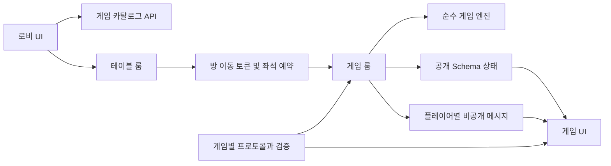

# 게임 확장성 개선 작업 계획

## 구현 현황

2026-07-16 기준 진행 상태다. 상대 import 경로 검사, Vue SFC 19개와 TypeScript 48개의 정적 구문 파싱, `git diff --check`는 통과했다. 자동 테스트와 빌드는 프로젝트 정책에 따라 아직 실행하지 않았다.

- [x] 원카드 손패·덱과 윷놀이 스킬을 공개 Schema에서 분리
- [x] 공통 payload 검증, 채팅 제한, 구조화 오류 응답 적용
- [x] 서버 발급 좌석 예약, 전원 도착 확인 후 전환, 부분 이동 시간 초과 시 취소 적용
- [x] 예약 정보 기반 방장 승계와 재대결 멤버 승계 적용
- [x] 게임별 metadata, definition, schema, protocol, domain 디렉터리 도입
- [x] 서버 카탈로그 API와 클라이언트 프로토콜 호환성 확인 적용
- [x] 클라이언트 상태 투영, 공통 채팅·활동 패널, 미지원 게임 화면 적용
- [x] 재연결과 개인 상태 재동기화, `wss` 선택, 구조화 오류 로그 적용
- [x] 로비 수신·렌더링 지표, 100개 단위 렌더링과 브라우저 렌더링 격리 적용
- [x] 원카드와 윷놀이 룸의 남은 상태 전이 및 효과 로직을 도메인 엔진으로 추가 이전
- [x] 게임 화면의 보드, 개인 패, 플레이어 패널, 결과 모달 추가 분리
- [ ] 사용자 실행 테스트 및 두 브라우저 수동 검증 완료

## 1. 목적

OBGC에 루미큐브를 비롯한 새 게임을 지속적으로 추가해도 기존 게임과 로비가 복잡해지지 않도록 구조를 정비한다.

이번 계획은 다음 문제를 해결하는 것을 목표로 한다.

- 게임별 비공개 정보가 다른 클라이언트에 노출되지 않도록 상태 경계를 분리한다.
- 방 이동과 방장 권한을 서버가 신뢰할 수 있는 정보로 판별한다.
- 게임 규칙, 통신, 화면을 분리하여 게임 하나의 파일이 계속 커지는 것을 막는다.
- 서버와 클라이언트의 게임 목록 및 프로토콜이 어긋나는 문제를 조기에 발견한다.
- 방과 게임 수가 증가해도 로비 탐색 및 렌더링 성능을 유지한다.

## 2. 작업 원칙

1. 서버를 모든 게임 행동의 최종 판정자로 유지한다.
2. 공개 상태와 플레이어 개인 상태를 명시적으로 구분한다.
3. 게임 룸은 접속, 권한, 메시지 전달을 담당하고 게임 규칙은 순수 도메인 로직으로 분리한다.
4. 새 게임 추가 시 기존 공통 파일을 여러 곳 수정하지 않도록 등록 지점을 최소화한다.
5. 큰 구조 변경은 단계별로 적용하고 각 단계에서 기존 게임 동작을 보존한다.
6. 로비 대규모 최적화는 실제 방 수 지표를 기준으로 도입하되 확장 지점은 미리 마련한다.

## 3. 목표 구조



게임별 권장 디렉터리 구조는 다음과 같다.

```text
server/src/games/<game-id>/
  definition.ts       # 게임 ID, 인원, 룸 클래스, 프로토콜 버전
  protocol.ts         # 메시지 이름, payload 타입, 런타임 검증
  schema.ts           # 클라이언트에 공개할 상태
  room.ts             # Colyseus 생명주기, 권한, 메시지 라우팅
  domain/
    engine.ts         # 상태 전이 및 행동 처리
    rules.ts          # 순수 규칙 함수
    types.ts          # 서버 내부 게임 모델

client/src/games/<game-id>/
  View.vue
  protocol.js         # 클라이언트 메시지 계약과 버전
  components/
    Board.vue
    PlayerPanel.vue
    Controls.vue
```

기존 `server/src/games/registry.ts`는 게임 등록의 단일 진입점으로 유지한다. 클라이언트의 화면 로더와 시각 속성은 클라이언트 전용 레지스트리에 남기고, 서버 지원 여부와 기본 메타데이터는 서버 카탈로그를 기준으로 확인한다.

## 4. 단계별 작업 계획

### 1단계. 비공개 상태 및 메시지 안전성 확보

루미큐브 구현 전에 완료해야 하는 최우선 단계다.

#### 1-1. 공개 상태와 비공개 상태 분리

대상:

- `server/src/rooms/MapleOneCardRoom.ts`
- 이후 추가되는 루미큐브 룸
- `client/src/components/games/MapleOneCardView.vue`

작업:

- 공개 Schema에서 원카드의 전체 `hand`와 `deck`을 제거한다.
- 공개 플레이어 상태에는 손패 개수, 순위, 접속 상태 등 다른 사용자에게 보여도 되는 값만 둔다.
- 실제 덱과 플레이어 손패는 서버 내부 컬렉션에 보관한다.
- 각 플레이어에게 자신의 손패만 전용 메시지로 전송한다.
- 재접속 시에도 본인 손패를 다시 받을 수 있도록 동기화 절차를 정의한다.
- 클라이언트는 공개 상태와 개인 손패 상태를 별도로 관리한다.

상태 경계:

| 구분 | 예시 | 전달 범위 |
|---|---|---|
| 공개 상태 | 턴, 버린 카드, 손패 개수, 승패 | 방 전체 |
| 개인 상태 | 자신의 카드 또는 타일 | 해당 플레이어 |
| 서버 전용 상태 | 덱 순서, 모든 플레이어의 실제 패 | 서버만 |

완료 조건:

- 한 클라이언트의 수신 상태와 메시지에서 다른 플레이어의 카드 또는 타일 식별자를 확인할 수 없다.
- 재접속한 사용자는 자신의 개인 상태를 복구할 수 있다.
- 기존 원카드의 턴, 공격, 드로우, 승패 규칙이 유지된다.

#### 1-2. 메시지 payload 검증 공통화

대상:

- `server/src/rooms/TableRoom.ts`
- `server/src/rooms/YutnoriRoom.ts`
- `server/src/rooms/MapleOneCardRoom.ts`
- 신규 `server/src/games/*/protocol.ts`

작업:

- 메시지마다 객체 여부, 필수 필드, 문자열 길이, 숫자 범위, enum 값을 검사한다.
- 채팅 길이 제한과 짧은 시간 내 반복 전송 제한을 추가한다.
- 잘못된 요청은 조용히 무시하지 않고 공통 오류 코드로 요청자에게 응답한다.
- 게임별 메시지 이름과 payload 타입을 `protocol.ts`에 모은다.
- 전체 배열을 받는 행동에는 최대 크기, 중복 ID, 소유권, 현재 상태 revision 검사를 적용한다.

루미큐브 추가 시 필수 검증:

- 존재하지 않거나 중복된 타일 ID 거부
- 다른 사용자의 타일 사용 거부
- 조합 규칙과 타일 보존 여부 검증
- 오래된 보드 상태를 기준으로 전송한 요청 거부
- 요청 하나의 타일 및 조합 개수 상한 적용

완료 조건:

- `null`, 잘못된 타입, 누락 필드 및 지나치게 큰 payload가 룸 예외를 발생시키지 않는다.
- 클라이언트가 오류 코드와 사용자용 메시지를 구분해 처리할 수 있다.

### 2단계. 방 이동 및 권한 모델 안정화

대상:

- `client/src/App.vue`
- `server/src/rooms/TableRoom.ts`
- `server/src/games/rematch.ts`
- 각 게임 룸의 `onJoin`, `onLeave`

작업:

- `localStorage`의 `playerId`를 방장 권한의 근거로 사용하지 않는다.
- 서버가 대상 방 ID, 플레이어, 만료 시간, 좌석을 묶은 일회용 이동 토큰을 발급한다.
- 게임 룸은 유효한 토큰 또는 좌석 예약이 있는 사용자만 지정된 자리로 입장시킨다.
- 클라이언트는 새 방 참가에 성공한 뒤 기존 방을 떠난다.
- 참가 실패 시 기존 방 연결을 유지하고 오류를 표시한다.
- 재대결 방 생성 시 기존 참가자와 지정 방장 정보를 함께 승계한다.
- 방장이 이탈했을 때의 승계 규칙을 서버에서 일관되게 적용한다.

권장 이동 흐름:

1. 테이블 룸이 게임 룸과 참가자별 이동 토큰을 생성한다.
2. 각 클라이언트에 대상 룸 ID와 본인 토큰만 전송한다.
3. 클라이언트가 기존 룸 연결을 유지한 채 대상 룸 참가를 시도한다.
4. 서버가 토큰을 검증하고 한 번 사용한 토큰을 폐기한다.
5. 대상 룸이 예약된 참가자 전원의 실제 연결을 확인하고 `migrationReady` 상태를 확정한다.
6. 준비 완료를 확인한 클라이언트만 기존 룸을 떠나 화면을 전환한다.
7. 제한 시간 안에 전원이 도착하지 않으면 대상 룸을 종료하고 모든 클라이언트가 기존 룸에 남아 재시도한다.

완료 조건:

- 클라이언트가 임의의 `playerId`를 전송해도 방장 권한을 얻을 수 없다.
- 잘못되거나 만료되었거나 재사용된 토큰으로 게임 방에 들어갈 수 없다.
- 새 방 참가 실패가 사용자를 로비로 강제 이탈시키지 않는다.
- 일부 사용자만 새 방에 참가한 상태가 확정되지 않고 제한 시간 후 기존 방으로 일관되게 복구된다.
- 재대결 시 기존 사용자와 방장 관계가 의도대로 유지된다.

### 3단계. 게임 모듈과 카탈로그 계약 정리

#### 3-1. 게임 룸의 도메인 로직 분리

대상:

- `server/src/rooms/MapleOneCardRoom.ts`
- `server/src/rooms/YutnoriRoom.ts`
- `server/src/rooms/maple-onecard/*`

작업:

- 룸에서 카드 또는 말 이동 규칙, 상태 전이, 승패 계산을 순수 함수 또는 엔진으로 이동한다.
- 룸에는 접속 생명주기, 권한 확인, payload 검증, 엔진 호출, 상태 반영만 남긴다.
- 난수 입력이 필요한 규칙은 주입 가능하게 만들어 결정적인 테스트가 가능하도록 한다.
- 기존 게임을 한 번에 모두 재작성하지 않고 원카드부터 분리한 뒤 동일한 패턴을 윷놀이에 적용한다.

완료 조건:

- 네트워크 룸 없이도 주요 게임 규칙을 단위 테스트할 수 있다.
- 룸 클래스가 게임 규칙 세부 구현을 직접 소유하지 않는다.
- 루미큐브가 동일한 모듈 템플릿으로 추가될 수 있다.

#### 3-2. 클라이언트 대형 컴포넌트 분리

대상:

- `client/src/components/games/MapleOneCardView.vue`
- `client/src/components/games/YutnoriView.vue`

작업:

- 보드, 개인 패, 플레이어 목록, 액션 컨트롤, 결과 모달을 작은 컴포넌트로 분리한다.
- 룸 연결 및 이벤트 구독은 게임별 composable 또는 View의 얇은 연결 계층에 모은다.
- 전체 상태를 `JSON.parse(JSON.stringify(...))`로 복제하지 않는다.
- 필요한 상태 조각만 반응형 값으로 투영하거나 Schema 변경 이벤트를 사용한다.
- 알 수 없는 게임 ID, 로딩 실패, 연결 종료 상태를 명시적인 화면으로 처리한다.

완료 조건:

- 게임 화면의 하위 UI를 룸 연결 없이 독립적으로 확인할 수 있다.
- 상태 변경마다 전체 게임 상태를 직렬화하지 않는다.
- 미지원 게임이나 동적 import 실패가 빈 화면으로 끝나지 않는다.

#### 3-3. 서버 카탈로그와 클라이언트 로더 역할 분리

대상:

- `server/src/games/registry.ts`
- `server/src/games/types.ts`
- 신규 게임 카탈로그 API
- `client/src/games.js`
- `client/src/components/LobbyView.vue`
- `client/src/components/GameFilterPicker.vue`

작업:

- 서버 레지스트리에서 룸 클래스가 제외된 공개 카탈로그 정보를 생성한다.
- 카탈로그에는 최소 `id`, `label`, `minPlayers`, `maxPlayers`, `protocolVersion`, `enabled`를 포함한다.
- 클라이언트는 서버 카탈로그와 로컬 화면 로더 및 시각 속성을 게임 ID로 결합한다.
- 서버에는 있지만 클라이언트 화면이 없는 게임, 또는 그 반대의 경우를 명시적으로 비활성 또는 미지원 상태로 표시한다.
- 서버와 클라이언트 게임 ID 일치 여부를 확인하는 계약 검사를 추가한다.

완료 조건:

- 게임 표시 이름과 인원 제한을 여러 화면에 중복 기입하지 않는다.
- 한쪽 등록 누락이 빈 화면이나 런타임 예외가 아니라 명확한 오류로 드러난다.
- 신규 게임 등록 절차가 게임 정의, 서버 레지스트리 연결, 클라이언트 로더 추가로 제한된다.

### 4단계. 로비 규모 확장 대응

이 단계는 현재 방 수를 측정한 뒤 순차적으로 적용한다.

#### 적용 기준

| 규모 | 권장 대응 |
|---|---|
| 방 100개 미만 | 현재 실시간 목록과 클라이언트 필터 유지 |
| 방 100~500개 | 방 목록 가상 스크롤 적용, 렌더링 측정 |
| 방 500개 이상 | 서버 필터, 정렬, 페이지네이션 또는 구독 범위 제한 검토 |
| 방 수천 개 이상 | 별도 방 디렉터리 및 게임별 집계 채널 검토 |

대상:

- `client/src/components/LobbyView.vue`
- `client/src/components/GameFilterPicker.vue`
- 로비 목록 제공 서버 계층

작업:

- 방 카드 렌더링 시간과 수신 목록 크기를 측정할 수 있는 지표를 추가한다.
- 일정 개수 이상에서는 가상 목록을 사용한다.
- 게임 필터의 게임별 방 개수는 전체 목록 반복 계산 대신 서버 집계 또는 단일 계산 결과를 사용한다.
- 서버 검색 도입 시 필터, 검색어, 정렬, cursor를 명시적인 쿼리 계약으로 정의한다.
- 실시간 이벤트와 페이지 결과가 충돌하지 않도록 방 ID 기준 병합 규칙을 둔다.

완료 조건:

- 정의한 목표 방 수에서 스크롤 및 필터 조작이 눈에 띄게 끊기지 않는다.
- 새 방 생성, 게임 변경, 인원 변경, 방 삭제가 현재 필터 결과에 정확히 반영된다.
- 페이지 이동 중 중복 방이나 사라지지 않는 방이 발생하지 않는다.

### 5단계. 정리, 버전 관리 및 운영 가시성

대상:

- `server/src/rooms/LobbyRoom.ts`
- `client/src/components/HelloWorld.vue`
- `client/src/assets/vue.svg`
- `client/src/App.vue`
- 게임별 definition 및 protocol

작업:

- 실제로 사용하지 않는 커스텀 `LobbyRoom`과 초기 템플릿 파일을 제거하거나 용도를 명시한다.
- HTTPS 환경에서는 `wss://`를 사용하도록 WebSocket 주소 생성을 정리한다.
- 게임 정의에 `protocolVersion`을 추가하고 버전 불일치 시 참가를 거부하면서 안내한다.
- 방 생성, 참가 실패, 토큰 검증 실패, 메시지 검증 실패를 구조화된 로그로 남긴다.
- 로그에 개인 손패, 이동 토큰 등 민감한 값을 기록하지 않는다.

완료 조건:

- 사용되지 않는 진입점이나 예제 파일이 신규 구현자를 혼동시키지 않는다.
- 배포 프로토콜에 따라 `ws`와 `wss`가 올바르게 선택된다.
- 운영 중 방 이동 및 메시지 실패 원인을 게임 ID와 오류 코드로 추적할 수 있다.

## 5. 권장 구현 단위

변경 범위가 지나치게 커지지 않도록 다음 단위로 나누어 진행한다.

1. 원카드 비공개 손패 및 덱 분리
2. 공통 메시지 오류 형식과 기존 게임 payload 검증
3. 이동 토큰, 좌석 예약 및 안전한 룸 전환
4. 원카드 도메인 엔진 분리
5. 윷놀이 도메인 엔진 분리
6. 서버 게임 카탈로그 API와 클라이언트 결합
7. 게임 화면 컴포넌트 및 상태 구독 분리
8. 프로토콜 버전, 오류 화면, 구조화 로그 추가
9. 측정 결과에 따른 로비 가상화 또는 서버 검색 도입
10. 루미큐브 구현

각 단위는 기존 게임을 플레이할 수 있는 상태로 끝나야 하며, 데이터 형식이 바뀌는 작업은 서버와 클라이언트를 함께 반영한다.

## 6. 검증 계획

### 자동 테스트로 추가할 항목

#### 레지스트리 및 카탈로그

- 게임 ID 중복 거부
- 잘못된 최소 및 최대 인원 설정 거부
- 서버 카탈로그와 클라이언트 로더 ID 불일치 감지
- 미지원 또는 비활성 게임 참가 거부

#### 상태 보안

- 상대방 손패와 덱 순서가 공개 Schema에 포함되지 않음
- 개인 손패 메시지가 해당 플레이어에게만 전달됨
- 재접속 시 본인의 개인 상태만 복구됨

#### 룸 이동 및 권한

- 정상 토큰으로 지정 방과 좌석에 참가
- 만료, 변조, 재사용 토큰 거부
- 새 방 참가 실패 시 기존 룸 유지
- 방장 이탈 및 재대결 시 방장 승계
- 게임 시작 후 허용하지 않는 설정 변경 거부

#### 프로토콜 및 규칙

- 잘못된 payload가 예외 없이 거부됨
- 서버와 클라이언트 프로토콜 버전 불일치 처리
- 원카드와 윷놀이의 주요 상태 전이 및 승패 판정
- 루미큐브의 조합 유효성, 타일 보존, 턴 원자성

#### 로비

- 방 생성, 삭제, 게임 변경, 인원 변경이 실시간 목록에 반영됨
- 필터 적용 중 변경된 방이 올바른 목록으로 이동함
- 페이지 또는 가상 목록에서 중복 및 누락이 없음

### 사용자가 실행할 권장 확인 명령

프로젝트 정책상 작업자가 임의로 테스트를 실행하지 않는다. 각 단계 구현 후 사용자가 아래 명령으로 확인한다.

```powershell
cd C:\WORK\OBGC\server
npm test -- --runInBand
npm run test:e2e -- --runInBand
npm run build

cd C:\WORK\OBGC\client
npm run build
```

실시간 동작은 브라우저 두 개 또는 시크릿 창을 사용하여 서로 다른 사용자로 확인한다.

- 한 사용자가 다른 사용자의 원카드 손패를 수신하지 않는지 확인
- 대기실에서 게임 변경 시 로비 목록과 필터가 즉시 갱신되는지 확인
- 게임 시작, 참가 실패, 재대결, 방장 이탈 흐름 확인
- 한 브라우저의 새 방 연결을 중단했을 때 다른 브라우저도 전환을 확정하지 않고 기존 방에서 재시도할 수 있는지 확인
- 네트워크 재연결 후 공개 상태와 개인 상태가 정상 복구되는지 확인

## 7. 루미큐브 착수 조건

다음 항목을 완료한 뒤 루미큐브 구현을 시작한다.

- [x] 공개 상태와 개인 상태 분리 방식 확정 및 원카드 적용
- [x] 서버 권한 기반 방 이동과 좌석 예약 적용
- [x] 공통 메시지 검증 및 오류 응답 형식 적용
- [x] 게임별 `room`, `schema`, `protocol`, `domain` 분리 패턴 확정
- [x] 서버 카탈로그와 클라이언트 로더 불일치 처리
- [x] 순수 게임 엔진 단위 테스트 작성 방식 확정

로비 가상화와 서버 페이지네이션은 루미큐브 착수의 필수 조건이 아니다. 실제 방 수가 적용 기준에 도달할 때 진행한다.

## 8. 전체 완료 기준

- 새 게임을 추가할 때 기존 테이블 룸, 로비 화면, 서버 시작 파일을 반복적으로 수정하지 않는다.
- 게임별 비공개 정보가 공개 상태나 로그에 포함되지 않는다.
- 방 이동 실패와 프로토콜 불일치가 복구 가능한 사용자 경험으로 처리된다.
- 게임 룸과 화면이 역할별 모듈로 분리되어 독립 테스트와 교체가 가능하다.
- 서버와 클라이언트가 지원하는 게임 목록의 불일치를 자동으로 발견한다.
- 로비는 정의한 목표 방 수에서 실시간 갱신과 필터 정확성을 유지한다.
- 루미큐브가 기존 게임과 동일한 등록 및 실행 흐름으로 연결된다.
